# Lets Get Quizzical

Lets get quizzical is an interactive and challenging quiz style trivia game. Users will be presented with a question which they will have to answer by clicking the button with the appropriate answer.

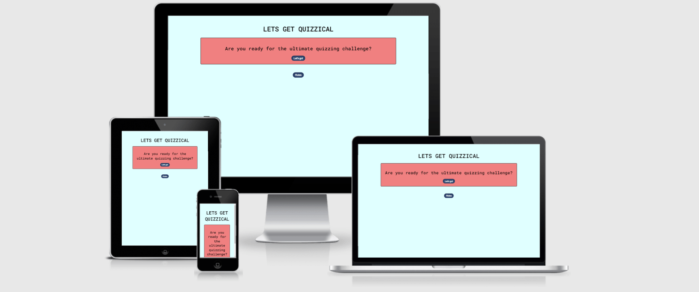

## Features

### Existing Features

- __Start Area__

  - This is the initial landing area for the user. It displays a button to start the quiz.
  - The button is an interactive element that allows the user to decide when they would like to start the quiz.
  - This is also the return page for restarting the quiz once exited
  
  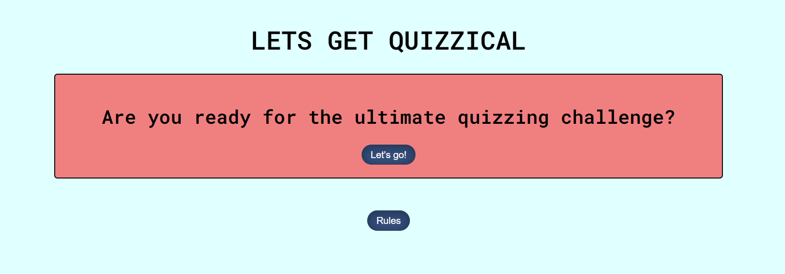

- __Rules Box__

  - A button will be on screen at all times for the user to click and access a panel with the game rules.
  - This panel contains rules and condtions of the game.
  - There is a button inside the panel to minimize the content box once a user no longer requires the information.
  
  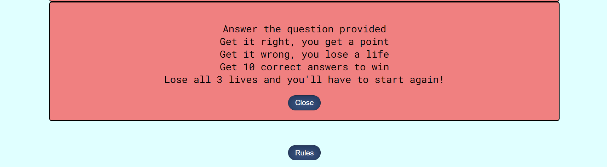

- __Quiz Page__

    - This is the main game page that contains all information relavent to the user during the game.
    - The question will appear here along with 4 answers, one of which is correct.
    - Each answer is presented on a button to allow the user easy and intuative selection.
    - Also displayed here are the score and life counters.

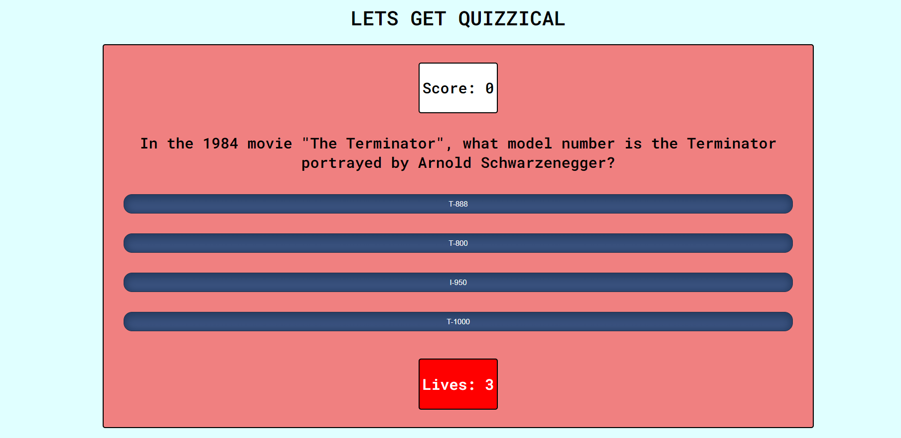

- __Random Questions__

    - All questions and answers are sourced from an external API (https://opentdb.com/) and will reload a new bank of questions and answers each game.
    - This adds replayability and will keep users engaged for more than one game.

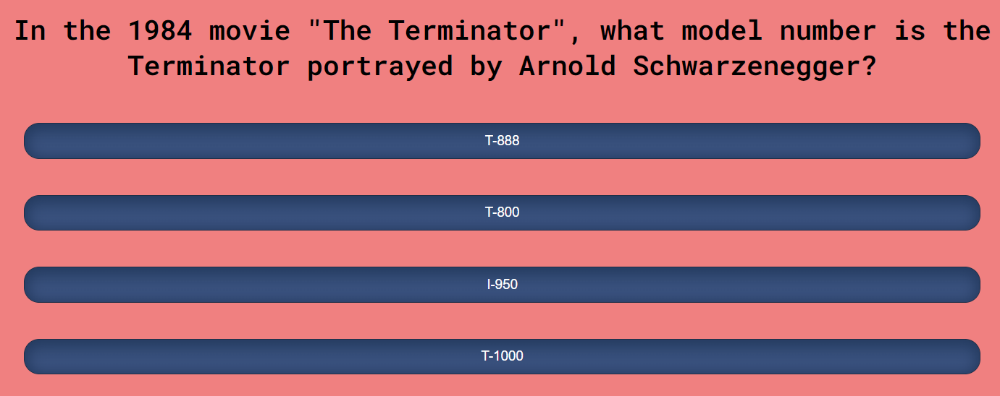

- __Score Counter__ 

  - The score counter is displayed on screen and will increment by 1 on every correct answer.
  - This allows a winning score to be set and also indicates user performance.

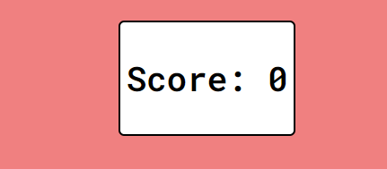

- __Lives Counter__ 

  - The lives counter is displayed on screen and will decrement by 1 on every incorrect answer.
  - The lives are set to 3 by default and will stop the game if the user has lost all 3.

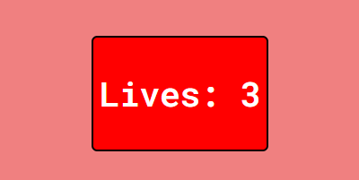

- __Message and Next Question__

    - This will show the correct conditional message depending on the users answer after they have selected their answer.
    - A button to continue the game is also displayed. Pushing this will advance to the next question.

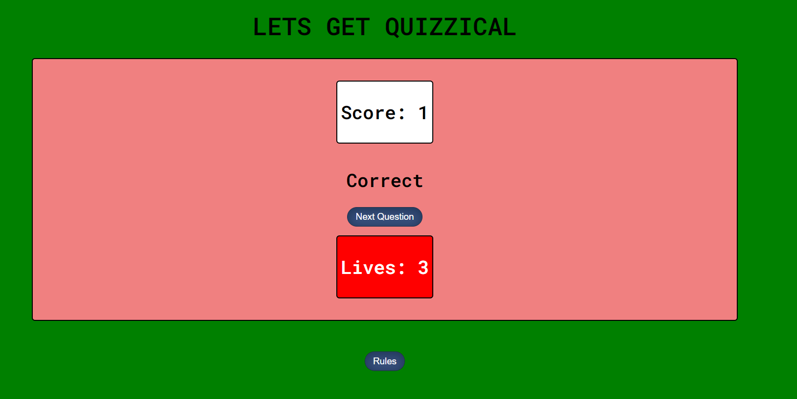
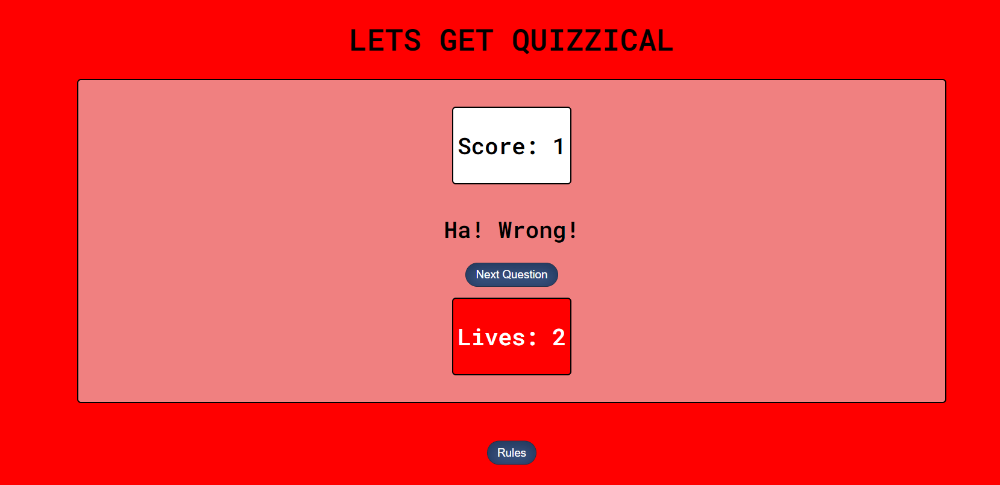

- __End Game Screen__

    - This appears if either of 2 conditions (game win or game lose) are met and will display the game result to the user.
    - There is also a restart button for the user to press if they would like to start the game again.

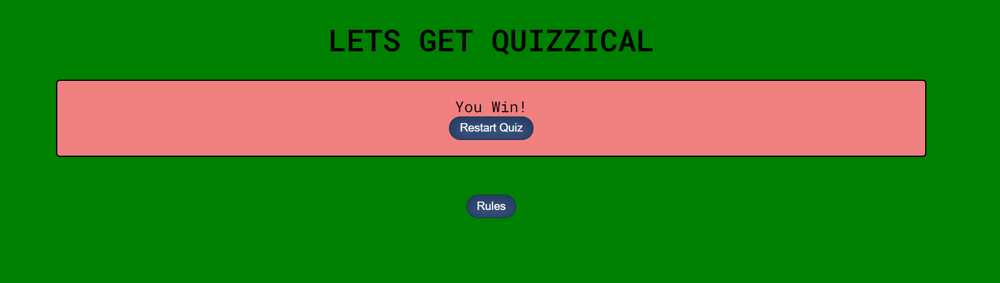
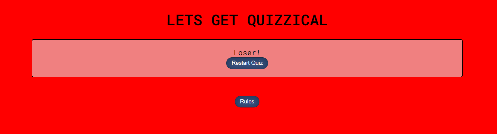

### Features left to Implement

    - Difficulty Selection.
    - Selectable Trivia Categories.
    - Multiple Rounds.
    - Username and Scoreboard.

### Technology Used 

    - Github
    - Gitpod
    - HTML 5
    - CSS 3
    - JavaScript

## Testing

Manual testing was done through devices I own and included my laptop, phone and tablet. I also tested the website on popular web browsers on my windows laptop. These included Chrome, Firefox, Edge, Opera and Safari.

### Validator Testing

- HTML
  - No errors were returned when passing through the official [W3C validator](https://validator.w3.org/nu/?doc=https%3A%2F%2Fharryodubhghaill.github.io%2Fjavascript-essentials-portfolio-project%2F).
- CSS
  - No errors were found when passing through the official [Jigsaw validator](https://jigsaw.w3.org/css-validator/validator?uri=https%3A%2F%2Fharryodubhghaill.github.io%2Fjavascript-essentials-portfolio-project%2F&profile=css3svg&usermedium=all&warning=1&vextwarning=&lang=en).
- JavaScript
  - No errors were returned when passing through [JSHint](https://jshint.com/).

## Deployment

- The site was deployed to GitHub pages. The steps to deploy are as follows: 
  - In the GitHub repository, navigate to the Settings tab 
  - From the source section drop-down menu, select the Main Branch
  - Once the Main Branch has been selected, the page will be automatically refreshed with a detailed ribbon   display to indicate the successful deployment. 

The live link can be found here - https://harryodubhghaill.github.io/javascript-essentials-portfolio-project/

## Credits 

### Code 

- API implimentation info came from Youtube channel ["The Coding Train"](https://www.youtube.com/watch?v=uxf0--uiX0I&t=835s).

### Media

- Questions are from an open source API [Open Trivia Database](https://opentdb.com/).
- Favicon was found here [Favicon](https://www.flaticon.com/free-icons/quiz).
- Fonts were sourced from [Google Fonts](https://fonts.google.com/).